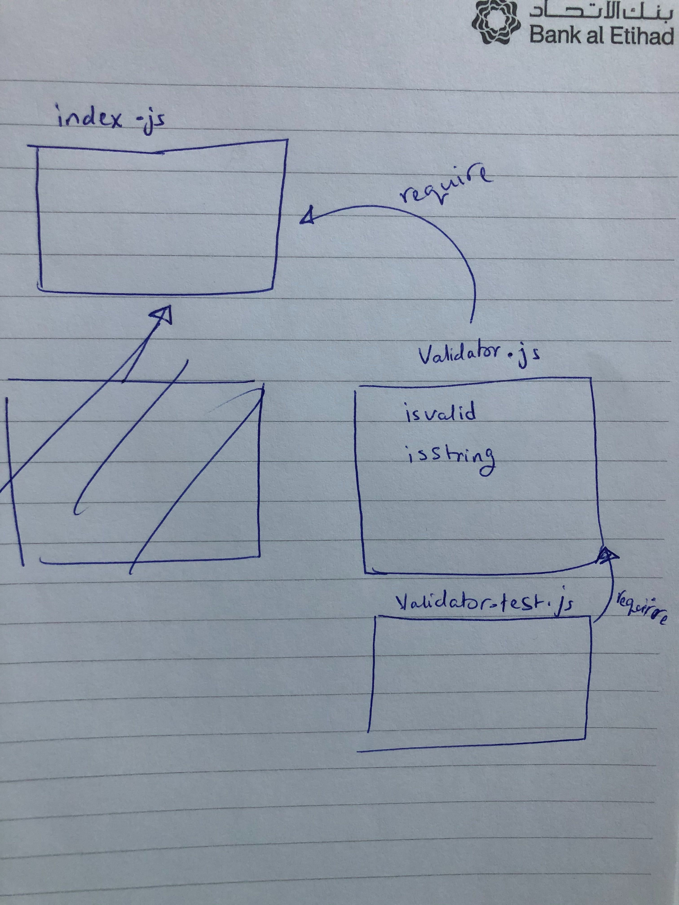

# LAB - Class 01

## LAB: Node Ecosystem

### Author: Muna

### Links and Resources

- [submission PR](https://github.com/401-advanced-javascript-muna/lab-01/pulls)
- [ci/cd](https://github.com/401-advanced-javascript-muna/lab-01/actions) (GitHub Actions)

#### How to initialize/run your application (where applicable)

 `npm run start`

#### Tests

- How do you run tests? npm run test
     
- Any tests of note?no
- Describe any tests that you did not complete, skipped, etc?completed

#### UML

Link to an image of the UML for your application and response to events

